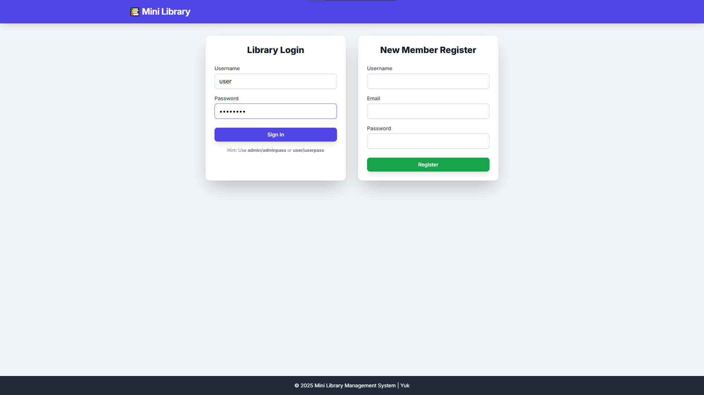
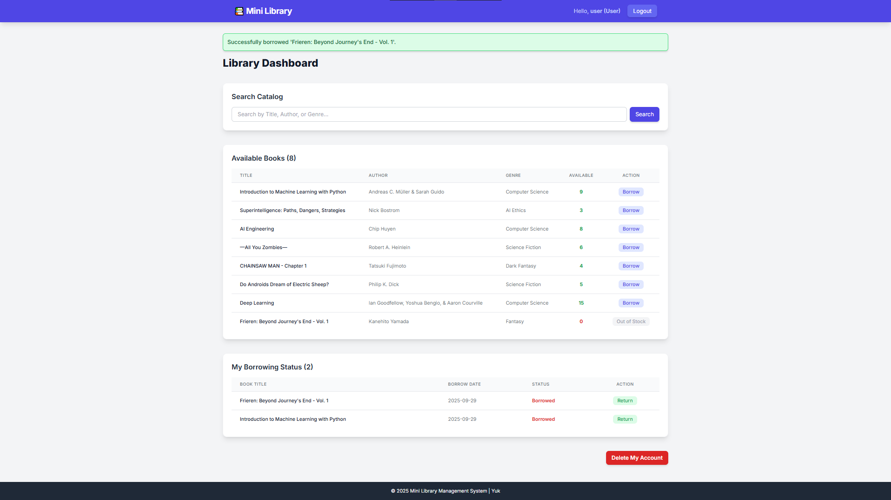
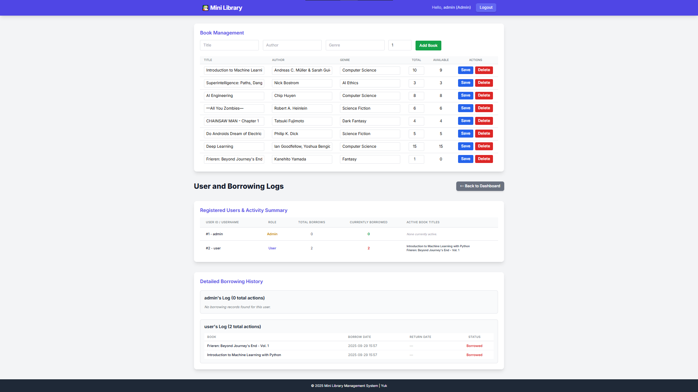

# **📚 Mini Library Management System**

A full-featured, three-layer Library Management System built with Python, Flask, SQLAlchemy, and SQLite. Supports user and admin roles, book catalog, borrowing/return, REST API, and more.

---

## **In-app Images**



*Login & Register Page*



*User's Dashboard*



*Admin's Dashboard*

## **Architecture Overview**

### **Layered Architecture**

- **Presentation Layer:** Flask routes, HTML templates (Jinja2)
- **Business Logic Layer:** CRUD functions, authentication, borrowing logic
- **Data Layer:** SQLAlchemy ORM models, SQLite database

```
[User/Browser]
    |
[Flask Routes & Templates]  <-- Presentation Layer
    |
[CRUD Functions, Auth, Logic]  <-- Business Logic Layer
    |
[SQLAlchemy Models & DB]  <-- Data Layer
```

---

## **Class Diagram**

```
+-------------------+      +-------------------+      +-------------------+
|      User         |      |     Book          |      |   Borrowing       |
+-------------------+      +-------------------+      +-------------------+
| id (PK)           |      | id (PK)           |      | id (PK)           |
| username          |      | title             |      | user_id (FK)      |
| email             |      | author            |      | book_id (FK)      |
| hashed_password   |      | genre             |      | borrow_date       |
| role              |      | total_copies      |      | return_date       |
|                   |      | available_copies  |      | status            |
+-------------------+      +-------------------+      +-------------------+
| borrowings (rel)  |<---->| borrowings (rel)  |<---->| user/book (rel)   |
+-------------------+      +-------------------+      +-------------------+
```

---

## **Database Schema**

- **User**: id (PK), username, email, hashed_password, role
- **Book**: id (PK), title, author, genre, total_copies, available_copies
- **Borrowing**: id (PK), user_id (FK), book_id (FK), borrow_date, return_date, status

**Relationships:**
- User 1---* Borrowing *---1 Book
- Borrowing.status: 'borrowed' or 'returned'

---

## **Project Structure**

```
backend/
├── app/
│   ├── __init__.py
│   ├── api.py         # REST API endpoints
│   ├── crud.py        # Business logic & CRUD
│   ├── models.py      # SQLAlchemy models
│   ├── routes.py      # Web routes (Flask)
│   └── utils.py       # Auth decorators
├── db/
│   ├── __init__.py
│   ├── database.py    # DB engine/session
│   └── init_db.py     # DB initialization/seed
├── templates/
│   ├── base.html
│   ├── dashboard.html
│   ├── admin_panel.html
│   └── index.html
├── main.py            # App entry point
├── requirements.txt
└── README.md
```

---

## **Setup and Run Instructions**

### 1. **Conda Environment Setup**
```bash
conda create -n library-env python=3.11
conda activate library-env
```

### 2. **Install Dependencies**
```bash
cd backend
pip install -r requirements.txt
```

### 3. **Initialize and Seed the Database**
```bash
python db/init_db.py
```
- Creates `mini_library.db` and seeds with admin/user accounts and sample books.

### 4. **Run the Flask Web Server**
```bash
python main.py
```

### 5. **Access the Webapp**
- Open: [http://localhost:5000](http://localhost:5000)

---

## **REST API Design**

All endpoints are under `/api/` and require authentication (session cookie).

### **Authentication**
- Log in via the web UI to obtain a session cookie. All API requests must include this cookie (handled automatically by browsers).

### **Endpoints**

#### **Books (Admin only)**
- `GET /api/books` — List all books
- `GET /api/books/<book_id>` — Get details for a book
- `POST /api/books` — Add a new book (JSON: `{title, author, genre, copies}`)
- `PUT /api/books/<book_id>` — Update a book (JSON: `{title, author, genre, copies}`)
- `DELETE /api/books/<book_id>` — Delete a book

#### **Users (Admin only)**
- `GET /api/users` — List all users with borrowing status
- `GET /api/users/<user_id>/borrowings` — Get all borrowings for a user

#### **Borrowing (User)**
- `POST /api/borrow/<book_id>` — Borrow a book (JSON: `{user_id}`)
- `POST /api/return/<book_id>` — Return a book (JSON: `{user_id}`)

#### **User Self-Management**
- `DELETE /api/users/me` — Delete your own account (only if you have no active borrowings)

### **Responses**
All endpoints return JSON. Example:
```json
{
  "id": 1,
  "title": "Book Title",
  "author": "Author Name",
  "genre": "Fiction",
  "total_copies": 5,
  "available_copies": 2
}
```
Errors:
```json
{
  "error": "You cannot delete your account while you have borrowed books. Please return all books first."
}
```

### **Usage Example (with fetch)**
```js
fetch('/api/books', { credentials: 'same-origin' })
  .then(res => res.json())
  .then(data => console.log(data));
```

---

## **Features**

- User registration, login, and session management
- Book catalog search, borrow, and return
- Admin panel for book and user management
- REST API for integration with other apps
- Account self-deletion (only if no active borrowings)
- Layered, modular codebase for easy extension

---

## **Security Notes**

- All API endpoints require authentication via session cookie
- Only admins can manage books and users
- Users cannot delete their account if they have borrowed books
- Passwords are securely hashed

---

## **Extending the System**

- Add new models to `models.py` and run migrations if needed
- Add new API endpoints in `app/api.py`
- Add new web pages/templates in `templates/`
- Update business logic in `crud.py`
